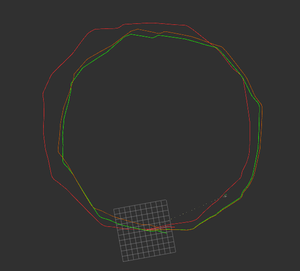

#### 1. 补充直接线性方法的里程计标定模块代码

需要补充构建超定方程组、求解方程和里程计帧间位姿的代码。
注： Eigen 矩阵未初始化会导致内部元素无限大(main.cpp line 308)
得到如下的标定结果，红色为里程计轨迹，绿色为激光里程计轨迹，橙色为标定后里程计轨迹

   
#### 2. 补充基于模型方法的里程计标定模块代码
  需要补充根据角速度积分求解J21J22和根据速度积分求解轮间距和半径的代码。
  得到标定结果为：
  b: 0.59796  
  r_L: 0.0979974  
  r_R: 0.101997  
  参考答案：轮间距b为0.6m左右，两轮半径为0.1m左右

#### 3. 通过互联网总结学习线性方程组 Ax=b 的求解方法,回答以下问题

对于该类问题,你都知道哪几种求解方法,以及优缺点?

1. 高斯消元法
2. LU 分解法: 将正方矩阵 A 分解成一个上三角矩阵和一个下三角矩阵.速度最快
3. QR 分解法: 矩阵 A 分级成一个正交阵 Q 和一个上三角矩阵 R 的乘积。实际中,
   QR 分解经常被用来解线性最小二乘问题,速度一般
4. LLT 分解法: 对称正定矩阵 A 可以分解成一个下三角矩阵 L 和 L 的转置 LT 相乘的
   形式,速度较快
5. SVD 分解法:对任意 M\*N 矩阵 A,都能被奇异值分解为 M\*M 正交矩阵,r 个对角
   线从大到小排列的奇异值矩阵,和一个 N\*N 的正交矩阵.常用在信息压缩,以及求广义逆.
6. 雅克比法:对于比较大的方程组更有效,使用迭代法可以根据不同的精度要求选择
   终止时间,因此比较灵活.
7. 高斯赛德尔迭代法: 所需的储存量少,每迭代一次只需一组存储单元,雅可比需要
   两组

#### 4. 设计里程计与激光雷达外参标定方法

你设计的方法是否存在某些假设?基于这些假设下的标定观测值和预测值分别是什么?如何构建你的最小二乘方程组求解该外参?
外参转换公式为：
$$T_{scan}^{map} = T_{odom}^{map}*T_{scan}^{odom} $$
需假设不考虑激光里程计和地盘里程计自身的误差，仅标定两者之间的转换矩阵，以里程计数据（轮系积分）作为预测，激光数据（icp）作为观测，构建方程组,其中A为$T_{odom}^{map}$，b为$T_{scan}^{map}$，得到最优解
