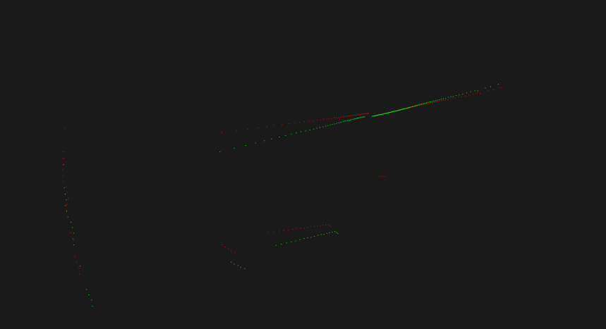

#### 1. 补充去除激光雷达运动畸变模块的代码

根据分段线性法进行畸变矫正，得到如下结果

   
#### 2. 阅读论文 Least-Squares Fitting of Two 3-D Points Sets,推导并证明已知对应点的 ICP 求解方法
使用SVD方法求解对应点的$R,t$关系
$$p_{i}^{'} = Rp_{i}+T+N_{i}$$
其中，R为旋转矩阵，T为平移矩阵，N为噪声
求解过程：
$$p_{i}^{''} = \hat{R}p_{i}+\hat{T}$$
求解重心
$$p_{i}^{'} = \frac{1}{N}\sum_{i=1}^{N}p_{i}^{'}$$$$p^{''} = \frac{1}{N}\sum_{i=1}^{N}p_{i}^{''}$$$$p = \frac{1}{N}\sum_{i=1}^{N}p_{i}$$
去中心化，令 $$q_{i} = p_{i}-p$$$$q_{i}^{'} = p_{i}^{'}-p^{'}$$
应用最小二乘
$$\sum \left \| q_{i}^{'} -R q_{i} \right \|^2 =\sum \left \| p_{i}^{'}-p^{'} -R (p_{i} -p)\right \|^2 $$
则可以将问题分解为先求$\hat{R}$,再求$\hat{T}=p^{'}-\hat{R}p$
使用SVD进行求解，构造$H = \sum q_{i}{q_{i}^{'}}^{T}$
分解得到$H=U\Lambda V^{T}$
进而$X=UV^{T}$
若$det|X| = 1$ 可以得到$\hat{R}=X$

最小二乘 $$min\sum \left \| q_{i}^{'} -R q_{i} \right \|^2=\sum({q_{i}^{'}}^{T}{q_{i}^{}}^{'}+{q_{i}}^{T}{q_{i}^{}}-2{q_{i}^{'}}^{T}R{q_{i}^{}})$$
即令最后一项最大
$$maxF = \sum^{N}{q_{i}^{'}}^{T}R{q_{i}^{}} =trace(\sum Rq_{i}{q_{i}^{'}}^{T}) = trace(RH)\geqslant trace(BXH)$$
其中 $H=\sum q_{i}{q_{i}^{'}}^{T}$
对于正定矩阵$AA_{T}$有
$$trace(AA^{T})\geqslant trace(BAA^{T})$$
$$trace(BAA^{T})=trace(A^{T}BA)=\sum a_{i}^{T}Ba_{i}\leqslant\sum a_{i}^Ta_{i}$$
因此$trace(BAA^{T})\leqslant trace(AA^{T})$
令$X=VU^{T}$,则$XH=VU^{T}U\Lambda V^{T}=V\Lambda V^{T}$
即为最大正交解，带回原式得到T

#### 3. 阅读论文 Precise indoor localization for mobile laser scanner 前两章

1)根据第二章内容,简述激光雷达测距原理
激光雷达主要有两种测距方式:飞行时间和相位差.
行时间是通过发送和接受激光束的时间差来计算,公式为$$r = \frac{\Delta t*c}{2n}$$
其中,c 是光速,n 是反射率,t 为时间差。
类似的,相位差法计算公式为
$$\Delta t = \frac{\Delta \phi *f_{m}}{2\pi}$$
其中$\phi $为相位差，$f_{m}$为频率。
通常采用相位差法,精度更高,且适用于相位差大于半波长的情况。
2)简要介绍一下右图的含义
该图表示激光的光束模型:
蓝色为扫到物体得到的距离,带高斯噪声;
红色为均匀分布的随机噪声;
绿色为有遮挡情况下的概率分布;
粉色为没有扫到物体,即返回最大值的情况。

#### 4. 设计使用 IMU 去除激光雷达运动畸变的方法并回答问题

1)仅用 IMU 去除运动畸变可能会有哪些不足之处
便宜的 imu 中的加速度计通常误差较大,里程计通过二次积分得到,会有较大的累计误差,影响畸变校正的效果
2)在仅有 IMU 和激光雷达传感器的情况下,你会如何设计运动畸变去除方案(平移+旋转),达到较好的畸变去除效果
IMU角速度相对精度较高,可以先校正激光的角度误差,然后通过激光里程计校准平移误差,综合得到校准后的数据