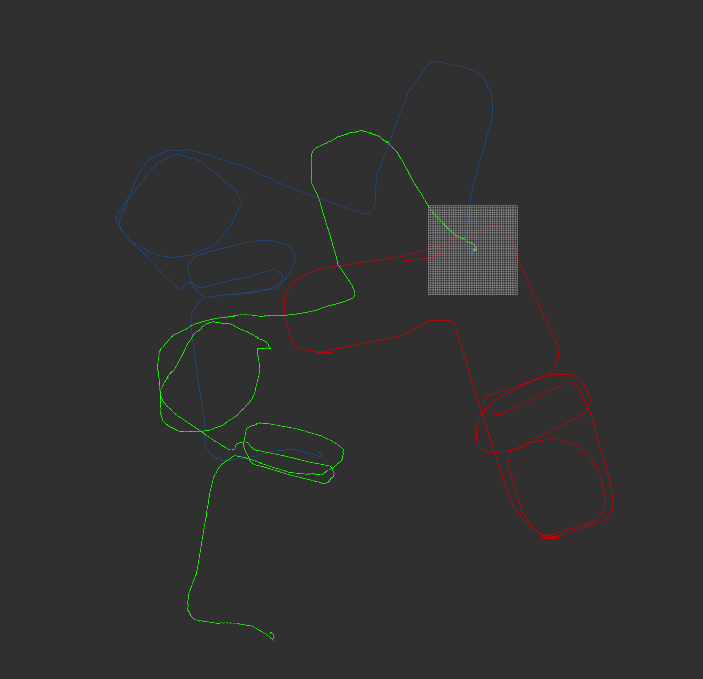

### 1. 补充代码，实现两帧间的IMLS-ICP 激光匹配
 见代码，imls_icp

### 2. 将第一题IMLS-ICP 匹配的接口换成第二次作业中CSM 库的ICP 匹配接口，并生成激光匹配的轨迹
 见代码，pl_icp

 

图 1. IMLS-ICP,PL-ICP,Odom轨迹

IMLS-ICP（绿色）,PL-ICP（蓝色）,Odom（红色）轨迹如图所示，ICP方法在拐弯处误差均较大，PL-ICP稍好一些

### 3. 阅读ICP 相关论文，总结课上所学的几种ICP 及其相关变型并简述其异同(ICP，PL-ICP，NICP, IMLS-ICP)
- ICP
  - 步骤
     1. 设置转换矩阵R，t，变换source点云，在target点云中找到与变换后source点云中点的最临近点，计算与target点云的误差，去除误差较大匹配点对
     2. 迭代优化R,t，使得误差最小
     3. 将更新的R,t应用到source点云中，重复步骤1，根据终止条件退出
  - 特点： 
     1. 对应点计算误差，精度高，复杂度高，易受干扰
     2. 一阶收敛
- PL-ICP
  - 步骤： 
      1. 设置转换矩阵R，t，变换source点云
      2. 在target点云中找到与变换后source点云中点的最临近的两点，计算source点与target两点连线的距离，去除误差较大匹配点对
      3. 迭代优化R,t，使得距离误差最小
      4. 更新R,t，重复步骤1，根据终止条件退出
  - 特点： 
      1. 相比于ICP，误差形式改为点到线的距离，对于结构化场景有优势
      2. 二阶收敛
      3. 初值敏感，通常与里程计、CSM配合使用
- NICP
  步骤： 与PL-ICP基本一致，增加对法向量、曲率的变换和误差计算，增加协方差矩阵调节权重
  特点： 用LM优化求解；增加法向量和曲率的误差判断
  
- IMLS-ICP
  - 步骤： 增加target曲面拟合，求source点到曲面的距离，其余与ICP一致
  - 特点 
    1. 理论精度最高
    2. 实际测试由于拟合曲面和投影的过程中用到了kdtree，计算速度较慢
    3. 测试数据集的效果不如PL-ICP 

### 4.简答题，开放性答案：现在你已经了解了多种 ICP 算法，你是否也能提出一种改进的 ICP 算法，或能提升ICP 总体匹配精度或速度的技巧？请简述你的改进策略
1. 点云畸变校正
2. 过滤动态障碍物
3. 增加Odom、Imu给定变换初值，或用类似CSM全局搜索的方法给定初始变换矩阵
4. 除了曲率和法向量，对结构化场景（如拐角），增加权重系数